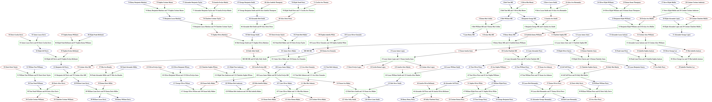
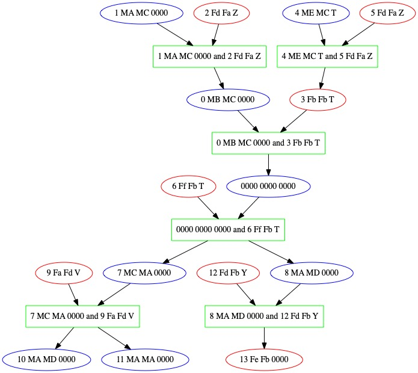
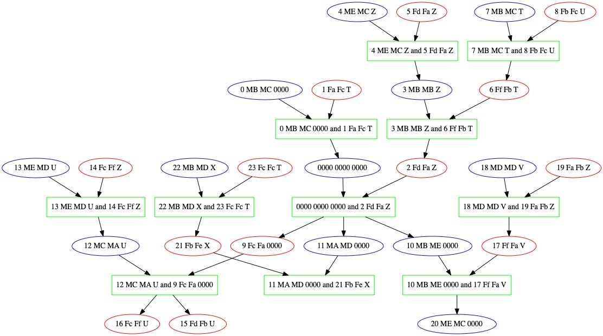
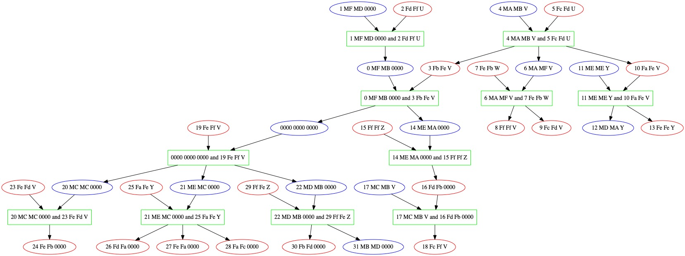
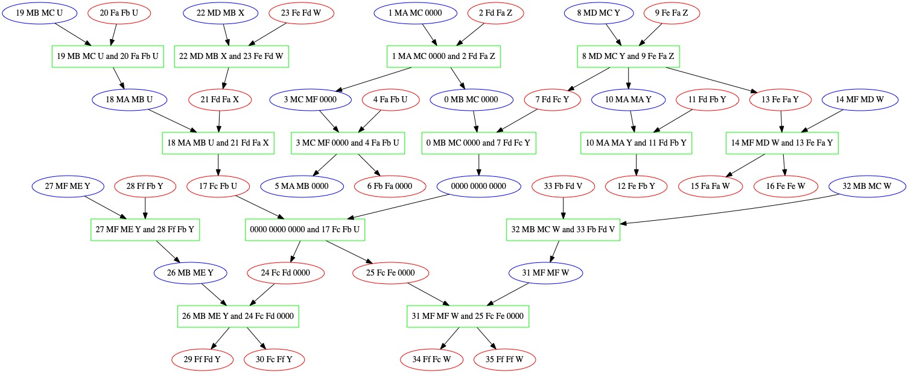

# Family Tree Generator

This project allows for the creation of fictional family trees. Given a list of names to choose from, it will create a plausible family tree.

### Why? 

Family trees have always seemed like a fun data structure, so I wanted to play around with them. They can take a while to build from scratch though. This allows for easy family tree generation and viewing. 

### Prerequisites

You'll need `graphviz` for this. If you are on mac you can just do `brew install graphviz`.

### How do I use it? 

1. Download the latest release from here: https://github.com/patbeagan1/FamilyTreeGenerator/releases
1. Ensure that the following files are present in the directory that you are running the application from:
    - `./namesFemale.txt`
    - `./namesMale.txt`
    - `./namesLast.txt`
1. Populate each `name<>.txt` file with a single name per line. You can see an example in the top level of this repo, [here](./namesFemale.txt). Lines can be commented out by starting the line with a "#".
1. Run the application with `java -jar <filename>.jar`. This will do the following: 
    1. You'll get a `family.dot` file generated in the top level of the repo. 
    1. As long as `graphviz` is installed, it will convert the dot file into a JPG called `out.jpg` in the top level of the repo
    1. As long as your OS knows the `open` command, the `out.jpg` file will be opened. 

### What does the output look like? 

The generated image should look something like this: 

---

### How can I change the names? 

If you'd like to run it with different names, change the names that appear in the `name<>.txt` files in the directory from which you are running the program.

### Why are the people numbered? 

The person ids ensure that they are unique within the graph. Otherwise, there is a small chance that two people will have the same name and create a cycle - not valid for a family tree!

### Why is there so much output?

Right now I have it set up to generate a couple of ancestors for people that marry into the family later on, and generate some descendants for generated ancestors. This helps make it seem less like they are popping up out of nowhere. You can disable this by changing the values that are injected into `Runtime`. 

These demos show the difference:
|| Without Inlaws | With Inlaws |
|-|-|-|
| Without Cousins |||
| With Cousins |||

### How are last names determined? 

Right now they are fixed patrilinearly - children keep the father's last name. There are [other ways that this could be done](https://en.wikipedia.org/wiki/Surname), and maybe they will be added in the future. 

### How big of a tree can this produce?

It seems like there is a practical limit for graphviz around 20 generations. Let me know if you find a way to go higher! 

### Roadmap

I put this together for fun, and don't plan on maintaining it regularly. If you see something that you would like me to change, or a feature that you would like me to add, feel free to file an issue and I will try to follow up.

### Contributing

- Reach out to me before doing refactors / adding features. 
- Documentation and test PRs are welcome anytime!
- File an issue before submitting a bug PR.
